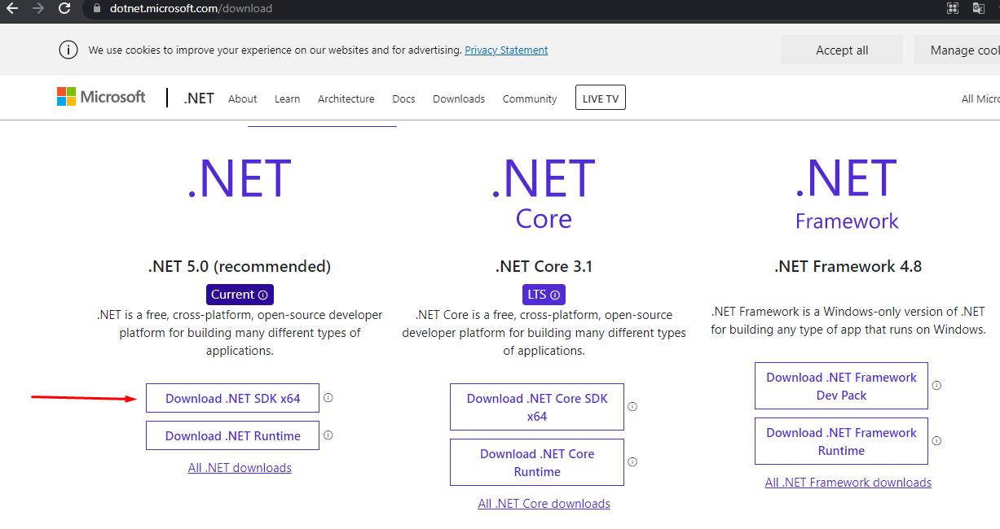
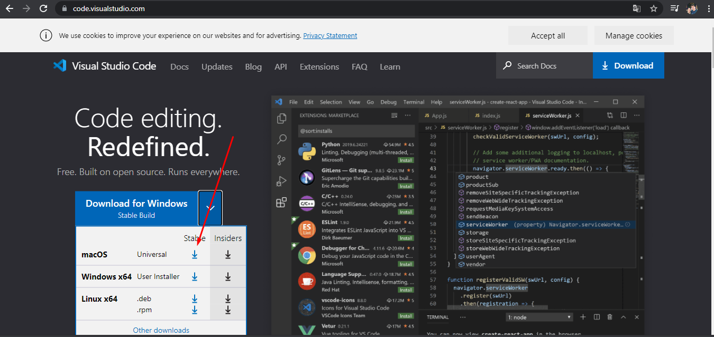
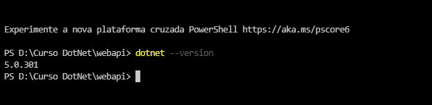
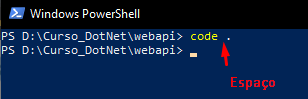

# WebApi

## Sobre o projeto
Projeto desenvolvido em Dot NET, com o objetivo de aperfeiçoar o conhecimento na linguagem

## Aplicação Web para a locação de filmes

<h4 align="center">
  🚧  React Select 🚀 Em construção...  🚧
</h4>

## Requisitos

- Instalar o DotNet 5.0
  <https://dotnet.microsoft.com/download>
  
- Instala o Visual Studio Code
  <https://code.visualstudio.com/>
  
escolha o seus sitema operacional, e por indicação, escolha a opção <b>Stable</b>, que é a útlima versão do Vscode, <b>Insider</b> é uma versão que ainda está me fase de teste
  

### Verificando instalação 

- abra o Visual Studio Code
- No terminal do Visual Studio Code rode o comando `donet --version`, para verificar se o DotNet foi instalado corretamente
- 

### Iniciando um projeto
- Abra o PowerShell, navegue até o local no qual deseja, criar o seu projeto através do comando `cd` (Exemplo:cd Documents/Projects/Locadora De Filmes) 
  
- Uma vês no local desejado, rode o comando `mkdir LocadoraDefilme` onde será criado a pasta para criar o projeto
- Vá até a pasta criada, e assim clicando com o botão direito clique na Opção Abrir om o Visual Studio, assim o VSCode já inicializa no local correto onde será criado o projeto
- No terminal do Visual Studio Code rode o comando `dotnet new WebApi`, onde já sera toda a estrutura inicial para um projeto web
- Após isso no Power Shell execute o comando `code .`, para abrir o Vscode já no projeto  
  
### Iniciando um projeto

- No terminal execute o comando `dotnet run`

- No navegador abra o <https://localhost:5001>, para visualizar a sua Api edite a url para **https://localhost:5001/swagger/index.html**
- Para abrir o swagger automaticamente, apenas clicando no locahost:5001 
    No Arquivo **Startup.cs**, localizar o método **Configure**, no `If` na linha `app.UseSwaggerUI(c => {c.SwaggerEndpoint("/swagger/v1/swagger.json", "web_api v1");`
inserir a linha  `c.RoutePrefix = string.Empty;`  
Ficará dessa forma:                       
                    `app.UseSwaggerUI(c => {
                    c.SwaggerEndpoint("/swagger/v1/swagger.json", "web_api v1")
                    c.RoutePrefix = string.Empty;
                    });`
  - No terminal execute o comando `dotnet run`

### Tecnologia Utilizada
- [DotNet5](https://dotnet.microsoft.com/)

